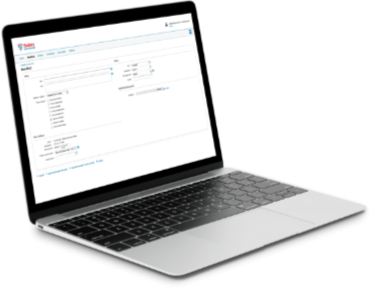
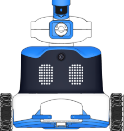
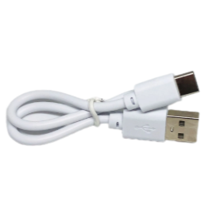
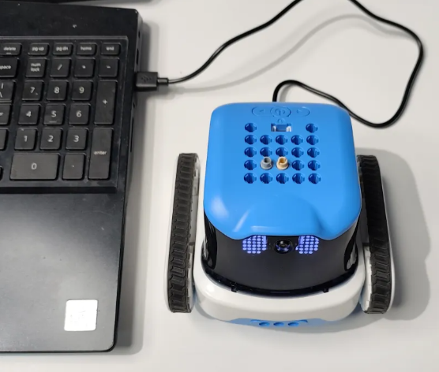
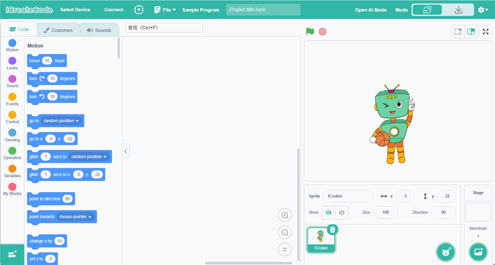
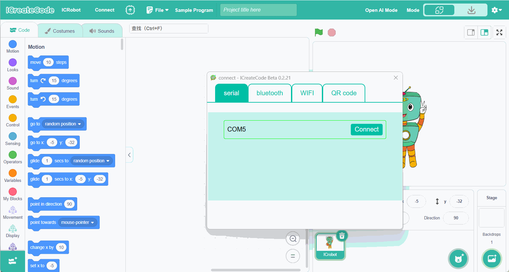
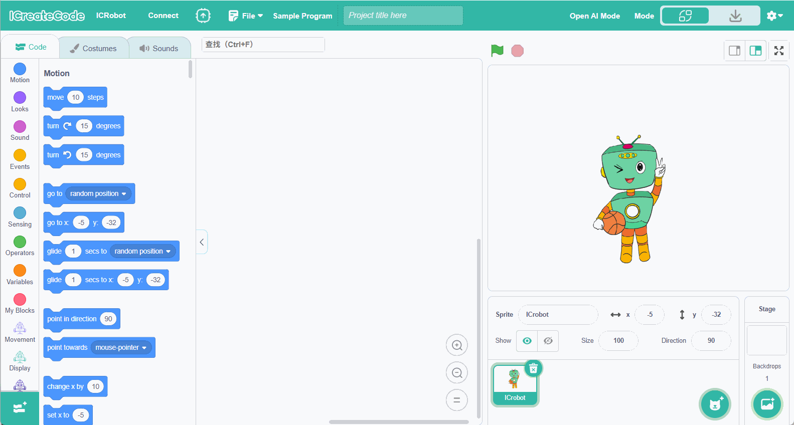
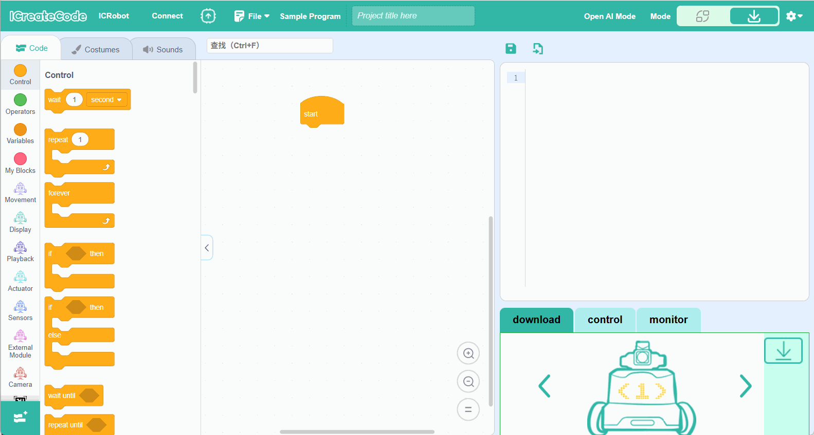
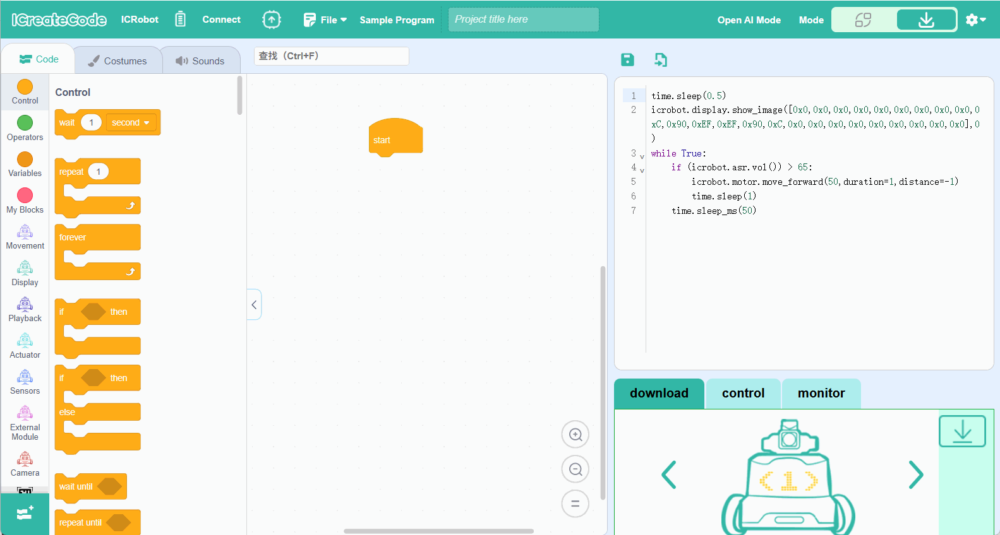

# Downloading Built-in Example Programs
**The robot can be connected to the computer via Serial Port, Bluetooth, STA, or AP mode. This guide uses the Serial Port connection as an example.**

##   Required Tools   
|  |  |  |  |
| :---: | :---: | :---: | :---: |
| computer | ICreateCode | ICRobot |  USB-C cable   |

## **Procedure**
|  |  |
| --- | --- |
| **Step 1.** After powering on the robot, connect it to the computer using a **USB Type-C cable**.   | **Step 2.** Open the programming software on the computer, click **"Select Device"**, and then select **ICRbot**.   |
|  |  |
| **Step 3.** In the **"Serial Port"** menu, select the correct port number, then click **"Connect"**.   | **Step 4.** Switch the programming software to **Download Mode**.   |
|  |  |
| **Step 5.** Open **"Examples"** and select **Python Examples**. Then select the built-in program you want to download. After selecting a program, its corresponding  code will be loaded automatically into the editor.   **Note:** All five factory-installed built-in programs are included in **Python Examples**. In this guide, **Program <2>** is used as the demonstration example.   | **Step 6.** Download the program. In the **Download** section, select the target program slot, then click **Download**. Once the download is complete, the software will display **"Download Successful"**. **Note:Program <2>** is used as the demonstration example in this guide.   |

