# Bluetooth Remote Control Guide
## **Definitions**
<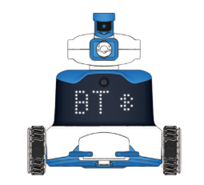

**The ICRobot robot supports two Bluetooth connection methods:**

+ **Bluetooth connection to the programming software**
+ **Bluetooth connection to a gamepad**

## **Software Interaction**
###  Preparation  
| 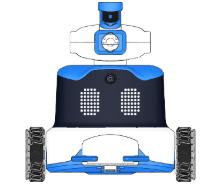 |  |
| :---: | :---: |
| ICRobot  | ICRemote |

###  Software Download  
 Click here to download the Android software package👉[ICRemote.zip](https://icreate-help-center.yuque.com/attachments/yuque/0/2026/zip/43021771/1785210973627-d647a83f-29dc-437a-ad88-b878581a169b.zip)

  

###  Operating Procedure  
| 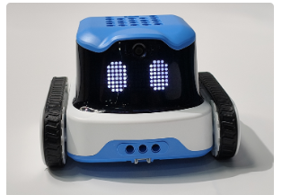 | 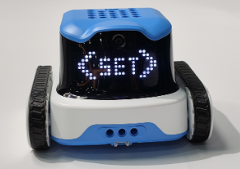 |
| --- | --- |
|  Step 1: Power on the ICRobot.   | Step 2: Press the Left Button repeatedly until the screen displays <SET>. Then press the Middle Button to confirm and enter the settings mode.   |
| 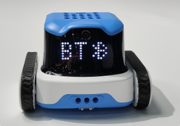 | 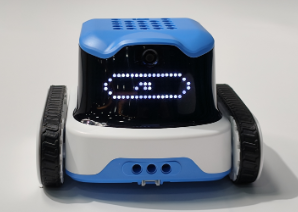 |
| Step 3: In the settings mode, press the Left Button or Right Button to select the connection mode. When BT is displayed, press the Middle Button to confirm  and switch to Bluetooth connection mode.   | Step 4: No manual operation is required. The ICRobot will automatically provide a voice prompt. +  Voice prompt: "Switching to Bluetooth mode."   The robot will wait for the mode switch to complete.  or +  Voice prompt: "The current mode is Bluetooth mode. No switching is required."   No waiting is required, and the robot can be used directly. |
| 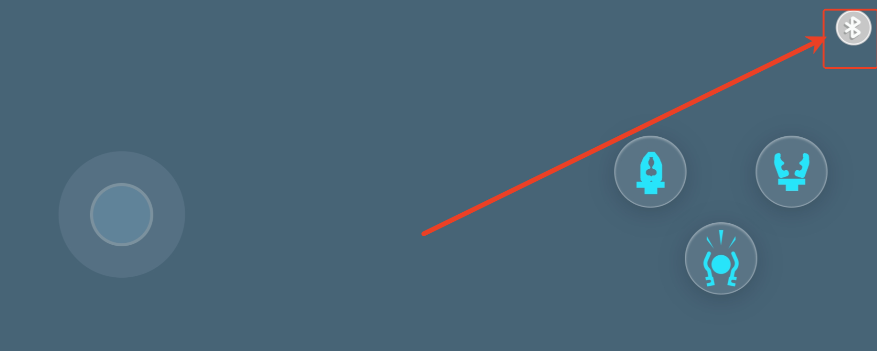 | 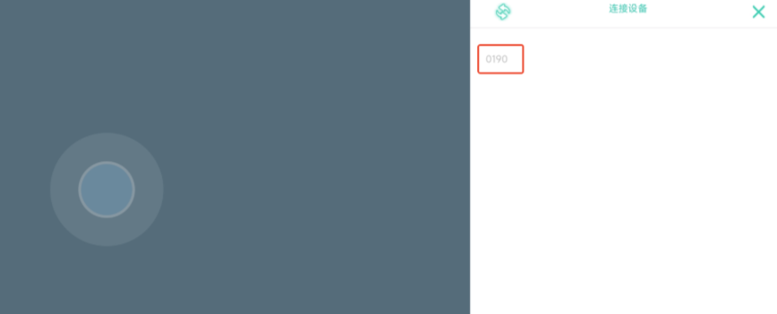 |
| Step 5: Open the Android application and tap the Bluetooth button to search for available devices. | Step 6: Select the device name to establish the Bluetooth connection.   |
|  | 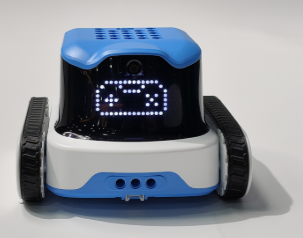 |
| Step 7: No manual operation is required. The ICRobot will provide a voice prompt indicating the connection status. +  Voice prompt: "Bluetooth connection successful." or +  Voice prompt: "Bluetooth connection failed." | Step 8: According to the program selection instructions, switch to Program 4. When the screen displays the controller icon, the program is ready. After the Bluetooth connection is successfully established, the ICRobot can be controlled through the Android application. |

## Bluetooth Controller Interaction
### Preparation
| 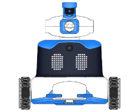 | 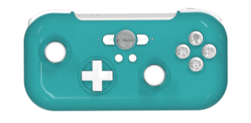 |
| :---: | :---: |
| ICRobot  |   Multi-Function  Bluetooth Gamepad   |

### Procedure
| 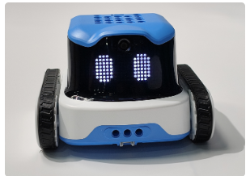 | 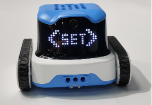 |
| --- | --- |
| Step 1: Power on the ICRobot. | Step 2: Press the Left Button repeatedly until the screen displays <SET>. Then press the Middle Button to confirm and enter the settings mode.  |
| 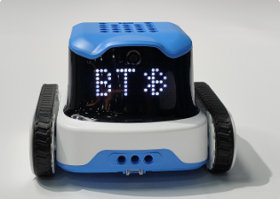 | 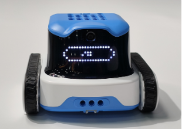 |
| Step 3: In the settings mode, press the Left Button or Right Button to select the connection mode. When BT is displayed, press the Middle Button to confirm  and switch to Bluetooth connection mode.   | Step 4: No manual operation is required. The ICRobot will automatically provide a voice prompt. +  Voice prompt: "Switching to Bluetooth mode."    The robot will wait for the mode switch to complete.  or +  Voice prompt: "The current mode is Bluetooth mode. No switching is required." No waiting is required, and the robot can be used directly. |
| 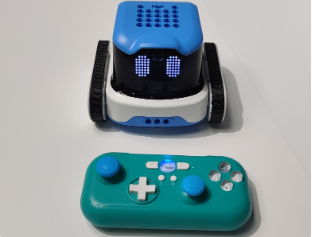 | 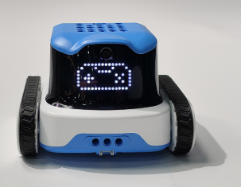 |
| Step 5: Follow the Bluetooth Controller Pairing Instructions to pair the Bluetooth controller with the ICRobot. During the pairing process, the ICRobot will provide a voice prompt indicating the connection status. +  Voice prompt: "Bluetooth connection successful." or +  Voice prompt: "Bluetooth connection failed." | tep 6: According to the program selection instructions, switch to Program 4. When the screen displays the controller icon, the program is ready. After the Bluetooth connection is successfully established, the ICRobot can be controlled through the Android application.  |

