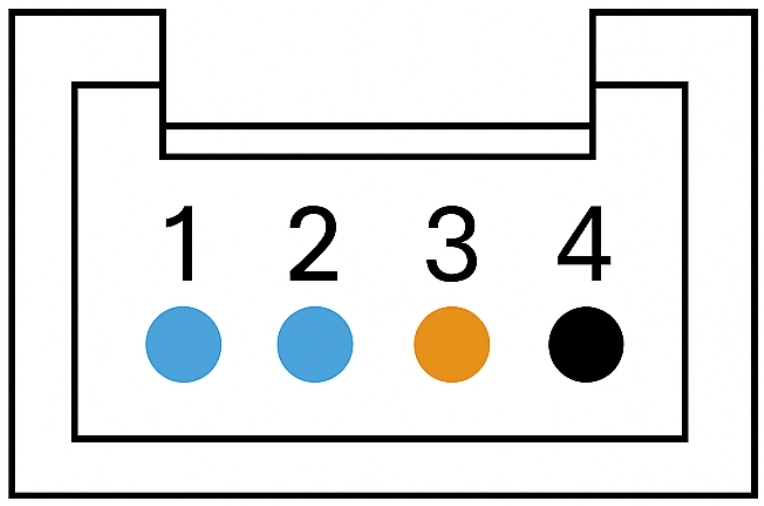

# Grove Interface

## Introduction
The product is equipped with four standardized modular connection ports (Grove interfaces), which are widely used in the open-source hardware field.

## Instructions for Use
The expansion ports located on the top of the ICRobot support a variety of connection functions.

The Port 1 signal pins are directly connected to the ESP32 chip’s GPIO8 and GPIO40, providing greater flexibility.

This port can function either as an I2C interface or as a standard Grove UART port.

In UART mode, the SCL pin corresponds to RX, and the SDA pin corresponds to TX.

This means that, in addition to I2C-compatible modules, some third-party non-I2C communication protocol sensors can also be connected through this port, depending on the specific device type.

The Ports 2–4 are different: they are expanded via an internal PCA9546 multi-channel I2C expander chip.

Therefore, these ports only support I2C protocol modules and are not compatible with devices using other communication protocols.

## Example: Robotic Gripper Object Pickup
### Connection Components:

