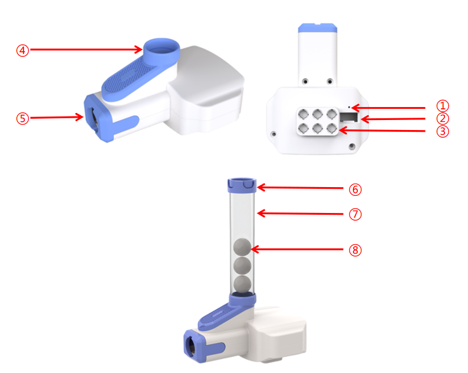

## Structure

| **No.** | **Name** | **Description** |
| :---: | :---: | --- |
| ① | Indicator Light | Indicates device status: lights up when connected to the robot; breathes when data is being transmitted. |
| ② | Grove Port | Connects via Grove cable. |
| ③ | Building Block Peg Holes | Used to attach the launcher to small-particle building blocks using half-pins. |
| ④ | Ammo Loading Port | Port for loading POM balls into the magazine. |
| ⑤ | Launcher Exit | Ball exit point during launching. |
| ⑥ | Magazine Lock Clip | Locks the extended magazine to prevent ball spillage. |
| ⑦ | Extended Ammo Magazine | Increases magazine capacity for more ammo. |
| ⑧ | Ammo Ball (12mm POM) | 12mm-diameter POM spherical balls used as projectiles. |

