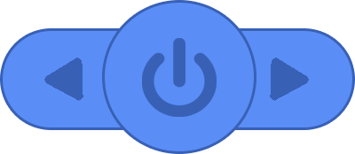

# Function Button
## 
## Introduction
The buttons are located on the top of the robot and are divided into the A button, the B button, and the on/off button. Through the buttons, users can easily control ICRobot to achieve a variety of functions and operations, providing a convenient interaction for programming learning and robot control.

## Usage Instructions
| Device State | Button Function |
| :---: | :---: |
|  Software connected | Buttons can be custom-programmed through coding. |
| No software connected | Buttons are used to switch and select ICRobot connection modes, and to run built-in programs. |

### [Demonstration](https://www.yuque.com/alexzhao-gaou9/icreaterobot/qd0d7ue8y0sckggb)
