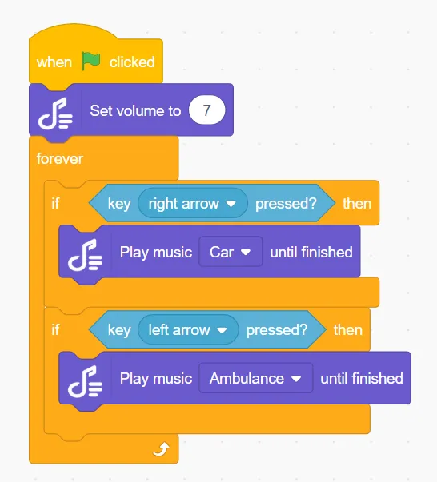
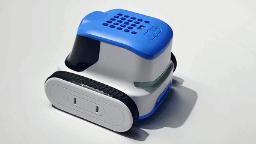
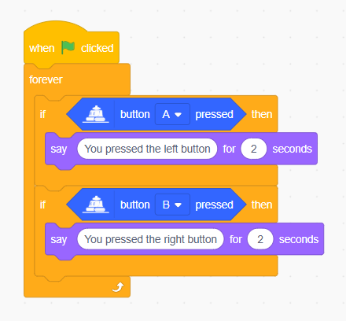
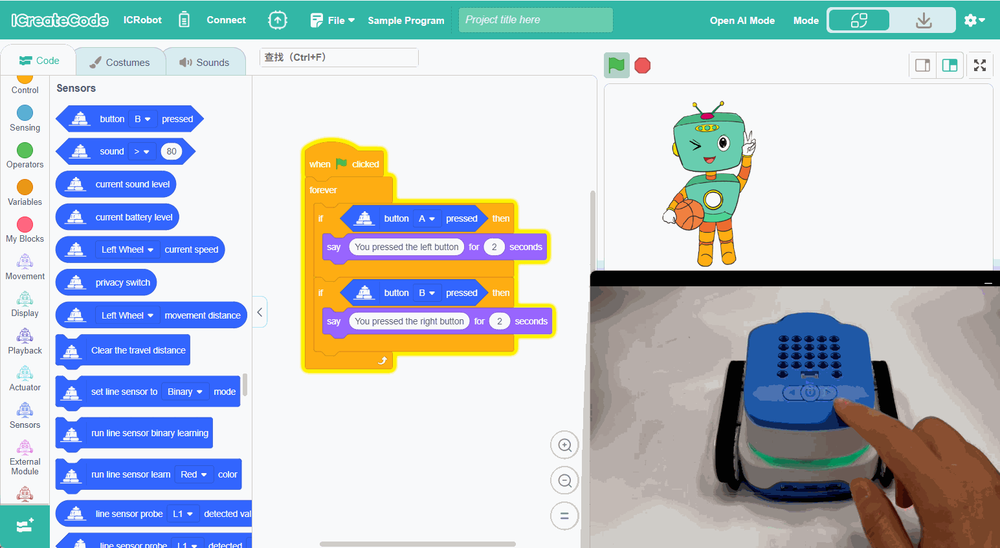
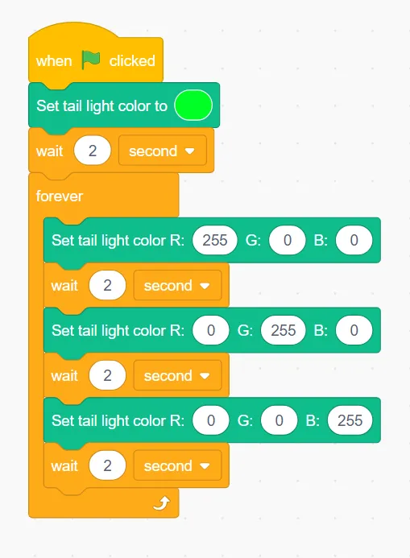

### Program

### Demonstration

## Function Button
### Example: Button Interaction 
Program Description: Customise the usage of the keys by programming the keys to interact with the stage character when the keys are pressed.

### Program

### Demonstration

## Programmable Tail Light Module
### Example: Tail Light Color Change 
Program Description: When the program is executed, the tail light is sky blue, wait for two seconds, then the tail light changes in a cycle of red, green and blue colours.

### Program

### Demonstration

## Microphone 
### Example: Voice-controlled Robot
Program Description: When an ambient sound greater than 70 is detected, the robot advances at 50% power for one second.

### Program

### Demonstration

