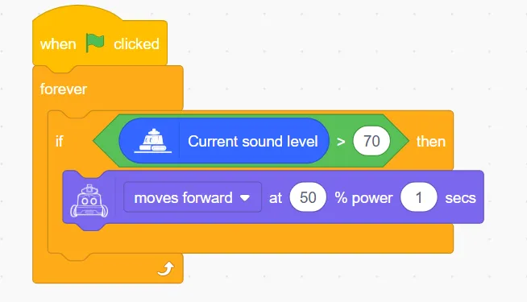

### Demonstration

## Microphone 
### Example: Voice-controlled Robot
Program Description: When an ambient sound greater than 70 is detected, the robot advances at 50% power for one second.

### Program

### Demonstration

