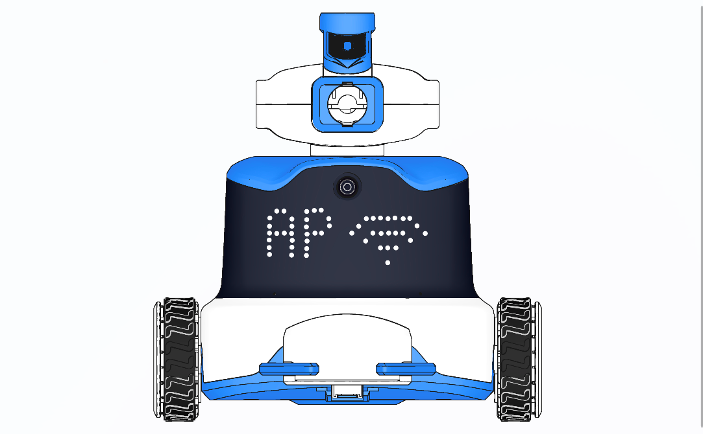
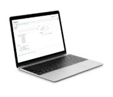
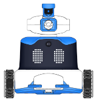

# Access Point Mode (AP Mode)
## Definition

In AP Mode, the ICRobot acts as a wireless hotspot. The PC searches for and connects to the robot's Wi-Fi signal to enable wireless communication.

## Preparation
|  |  |  |
| :---: | :---: | :---: |
| A computer (Windows/macOS) | ICreateCode software | ICRobot |

To Disconnect

If you wish to disconnect, simply click “Disconnect current device” in the connection box within the software.

