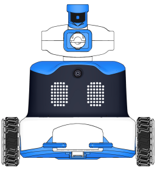
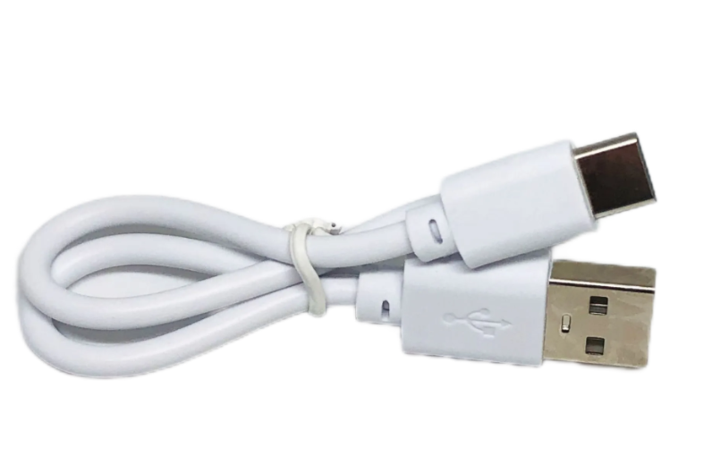
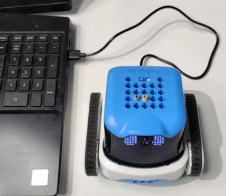
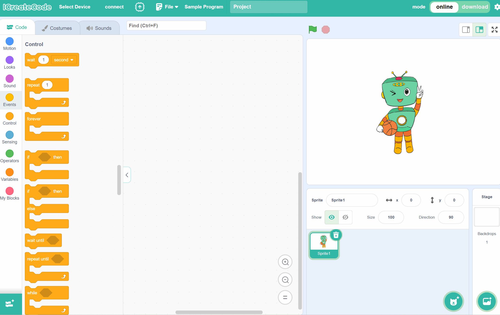
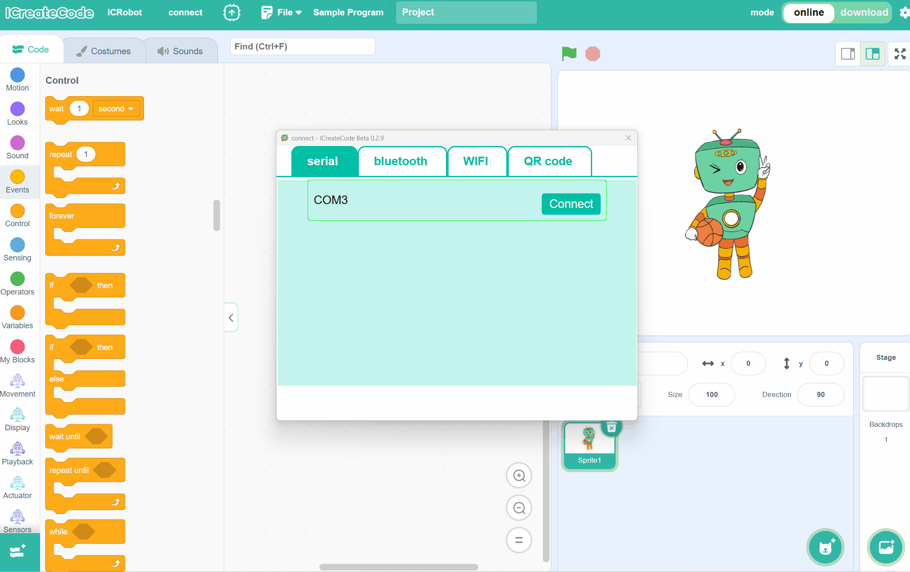

# Serial Connection
## Preparation
|  |  |  |  |
| :---: | :---: | :---: | :---: |
| A computer  (Windows) | ICreateCode | ICRobot&nbsp;&nbsp;&nbsp;&nbsp;&nbsp;&nbsp;&nbsp;&nbsp;&nbsp;&nbsp;&nbsp;&nbsp; | USB-C Cable 

## Steps
|  |  |
| :---: | :---: |
| Step 1: After turning on the robot, switch the robot to **USB mode**. | Step 2. After powering on the robot, connect the robot to the computer using a USB-C data cable. | 
|  |  |
| Step 3. Open the programming software on the computer, click "Select Device", and choose ICRobot. | Step 4. In the "Serial" option, select the correct port number, then click "Connect". |

