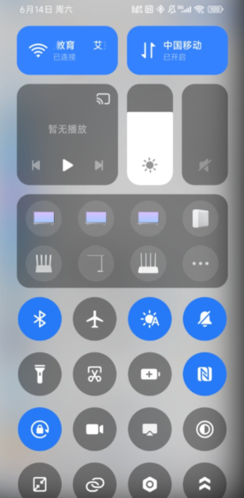
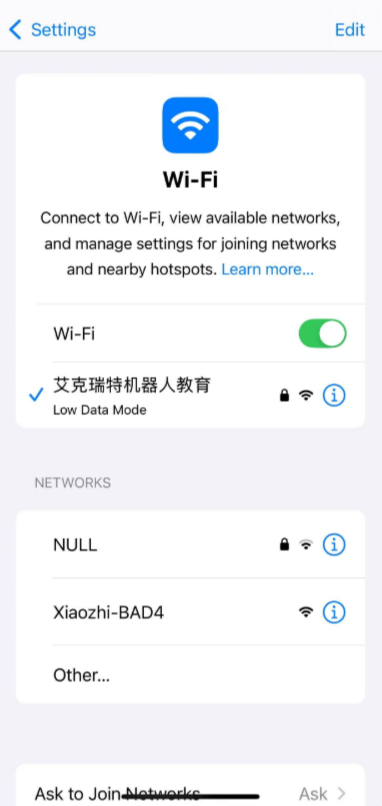
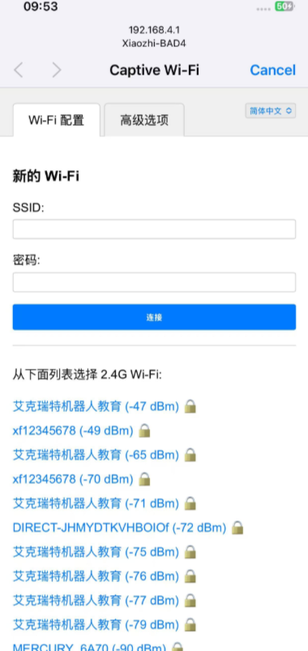
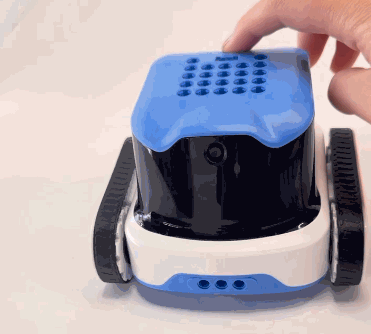
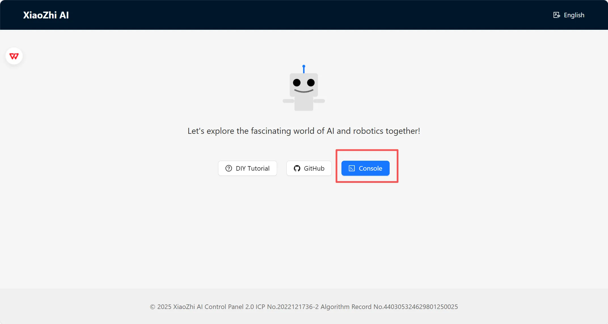
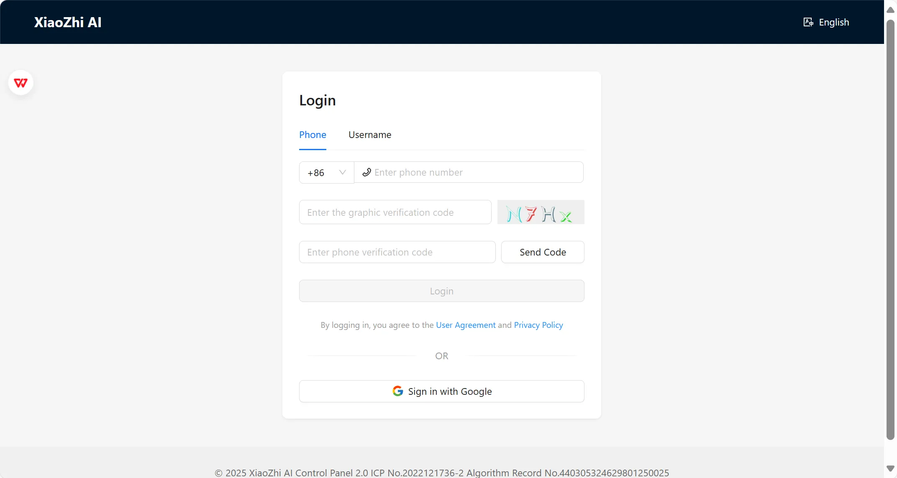
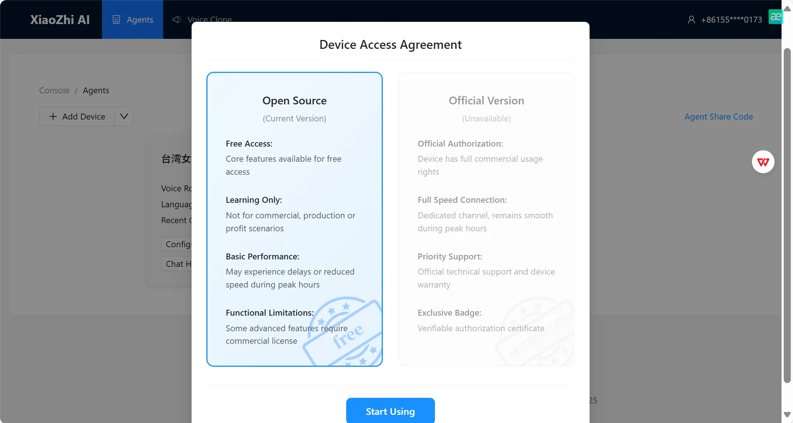
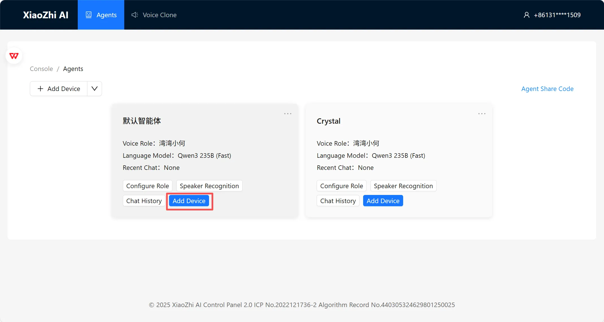
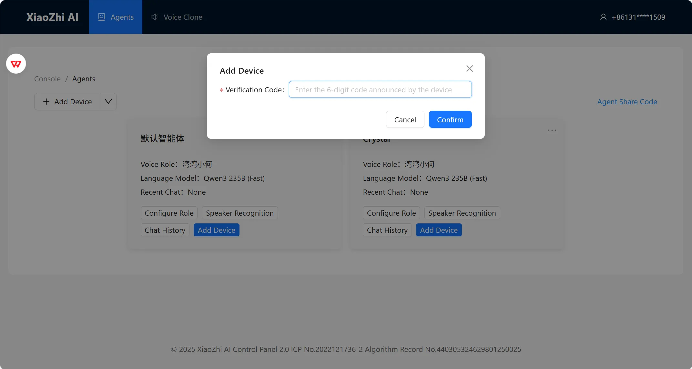
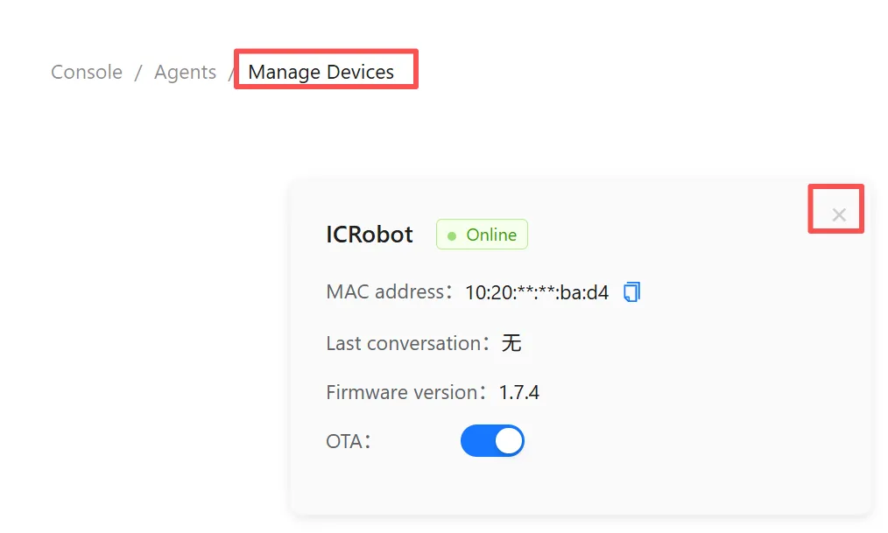

# XiaoZhi AI Configuration Guide
## Instructions
ICRobot Xiaozhi AI  mode, two steps are required before use.

Step 1. Switch the ICRobot internal firmware to Xiaozhi AI, the method can refer to [the firmware switching](https://icreaterobot-icrobot-docs.readthedocs.io/en/latest/docs/ICRobot/07FirmwareManagement/03FirmwareSwitching.html).

Step 2. Connect ICRobot to configure the network operation, details can refer to the contents of this document.

## Connect & Configure Wi-Fi
**Important: Read Before Operation!!!**
When using the backend for the first time, you must register and log in using a mobile phone number. Otherwise, you will not be able to access the backend.

**Recommendation:**
**Step 1:** Complete the backend registration first. After adding the console, remain on the verification code entry screen. For detailed instructions, refer to the **Backend Registration** section below.

**Step 2:** Power on the device. After startup, the device will prompt **“Entering network configuration mode.”**

**Step 3:** Configure the network connection for the robot and wait for the robot to announce the verification code. For detailed instructions, refer to the **Network Configuration** section below.

**Step 4:** Enter the announced verification code in the backend to establish the device connection.

_Note: If the device has already been configured with a network connection, but you want to clear the current network configuration and connect to another network, power on the device in __**Xiaozhi Mode**__, use the __◀️__ __▶️__ buttons or the __🅰️__ __🅱️__ buttons to switch to the __**Wi-Fi**__ interface, and then press the Power button to reset the network configuration. For detailed instructions, refer to the __**Reset Network**__ section below._

### Network Configuration
|  |  |
| --- | --- |
| On your mobile device, go to Settings > Wi-Fi. | Select the network XiaoZhi-XXXX, where XXXX represents the last 4 digits of the MAC address. |
|  |  |
| Your phone should automatically redirect to the network configuration page. | If your phone does not auto-redirect, open a browser and manually enter: [http://192.168.4.1](http://192.168.4.1) This will take you to the same configuration page. |
|  |  |
| ● If you select the wifi name (SSID) from below, you only need to fill in the password. ● or Manually fill in the wifi network name (SSID) and password to connect to the network. | After clicking Connect, the connection is successful, please wait patiently for the device to reboot. Note:  After the device reboots and turns on, it will broadcast the device code, please make sure to remember the device code broadcasted by the device! |

###  Reset Network  
| |  |
| --- | --- |
| **Step 1:** Power on the machine in **Xiaozhi Mode**. | **Step 2:** Use the ◀️ ▶️ buttons or the 🅰️ 🅱️ buttons to switch to the screen displaying **“WIFI”**, and select it. |
|  |  |
| **Step 3:** The machine will announce “Entering network configuration mode”.  Then, follow the steps described in **Network Configuration** above to connect the machine to a new network. | |

### Register & Bind Device
|  |  |
| --- | --- |
| Open a browser and go to: 🔗 [https://xiaozhi.me/](https://xiaozhi.me/) Click “Console” to enter the management dashboard. | Register with your mobile phone number and verification code.    |
|  |  |
| Select “Open Source Version” | Click “Add Device” |
|  |  |
| Enter the Device Code announced by the robot, then click Confirm. If you did not note the Device Code, simply power off and restart the device — it will announce the code again upon startup. | Once the confirmation screen appears, your XiaoZhi AI setup is complete. Note: If the device is already bound to an existing user account and you wish to bind it to a new account, please first remove the device from the original account before proceeding. |

