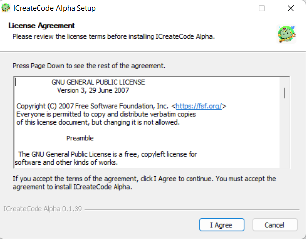

# Software Installation ICreateCode
## System Requirements
The ICreateCode programming software supports both Windows and macOS platforms.

Windows: Requires 64-bit Windows 10 or later;

macOS: Compatible with latest standard versions;

## Download
You can download the ICreateCode installation package from the official [ICreateRobot](https://www.icrobot.com/www/cn/index.html#/file/index?type2=ICRobot) website.

## Installation Steps
1. Locate the downloaded installation file on your computer. Double-click the file to begin installation.

2. When the installation window appears, click "我同意"（I Agree) to accept the license agreement.

By default, select “Install for me only”, then click Next.

Note: You will be prompted to choose whether to install the software for the current user only or for all users on the computer. The difference is as follows:

    1. Install for me only : 

This option installs the software for the current user account only. After installation, only this user can access and use the software.

    2. Install for anyone using this computer (all users):

This option installs the software for all user accounts on the computer. Any user on this device will be able to run the software.

Choose installation path: It is recommended to install to Disk C. If C drive space is insufficient, click Browse to choose another drive.

Click Install and wait for the process to complete.

Just wait for the installation to be complete.

Click mouse to complete, and then the network access permission will pop up. Be sure to select Allow.

  

The software is installed.  

