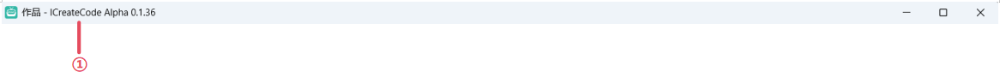
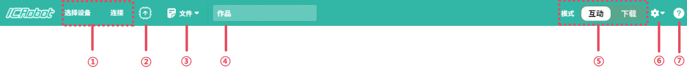
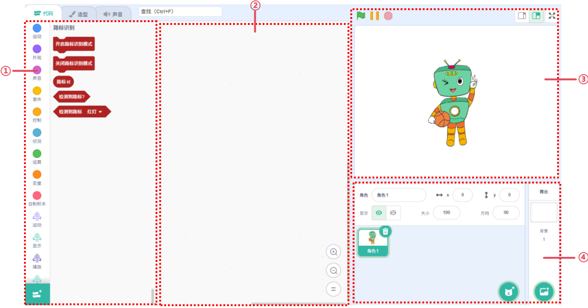
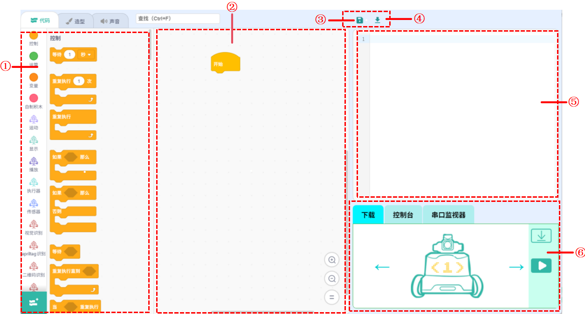

# Interface Guide
## Title Bar

| No. | Name | Function Description |
| :---: | :---: | :---: |
| ① | Software Name | Displays the current software name and version number |

## Toolbar

| No. | Name | Function Description |
| :---: | :---: | --- |
| ① | Select Device | Choose and connect different devices (e.g., ICBricks, ICRobot, ICMaster) |
| ② | Firmware Burn | Select and burn standard firmware or XiaoZhi AI firmware to ICRobot |
| ③ | File | Dropdown menu includes: New Project, Open Local Project, Save As, Export Project, Save Snapshot |
| ④ | Project | Rename the current project |
| ⑤ | Mode | Switch between Live Mode and Download Mode |
| ⑥ | Settings | Customize language, theme color, desktop layout; manage Serial/Bluetooth/WiFi/QR setup, firmware |
| ⑦ | Help | View Desktop Setup Guide, Privacy Policy, About, Source Code Info, Donation Page |

## Editing Interface
### Live Mode

| No. | Name | Function Description |
| :---: | :---: | --- |
| ① | Code Blocks | Choose from various categories: Motion, Looks, Sound, Control, Events, Sensing, Operators, Variables, My Blocks |
| ② | Coding Area | Drag and drop blocks here to create your program |
| ③ | Stage Area | Shows real-time feedback and interactions of programmed characters |
| ④ | Character Areas | Add/edit characters or background images for the stage |

### Download Mode

| No. | Name | Function Description |
| :---: | :---: | --- |
| ① | Block Instructions | Used to select different types of building block instructions and different types of extensions. Building block instructions include motion, appearance, sound, control, event, detection, operation, variables, and homemade building blocks. |
| ② | Coding Area | Drag and organize code blocks for offline coding. |
| ③ | Save | Save the current project locally. |
| ④ | Import | Import existing .py files for use in the current project. |
| ⑤ | Python Code Area | Shows the Python code equivalent of the block program; editable. |
| ⑥ | Hardware Control Panel | Download: Upload code to the ICRobot.	   Console: View real-time sensor/button/camera states when connected.   Serial Monitor: Send and receive serial data directly. |

