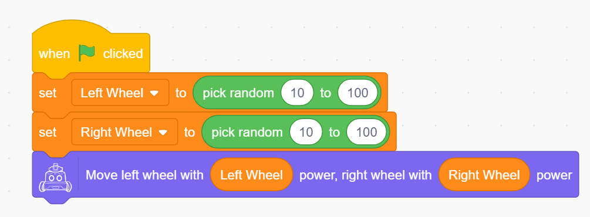
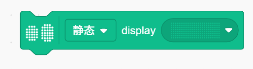
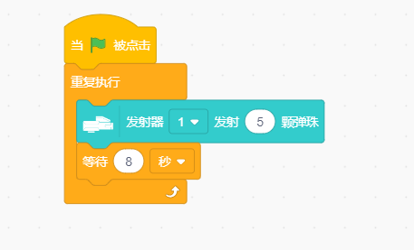

#ICRobot Block Guide
## Motion
### Move (Forward/Backward/Turn Left/Turn Right) at ( ) power

Controls the robot to move in the specified direction at the given power.

Example:

### Move (Forward / Backward / Turn Left / Turn Right) at () Power for () Seconds

Controls the robot to move in the specified direction with a given power for a certain number of seconds. This is a blocking block.

Example:

### Move (Forward / Backward / Turn Left / Turn Right) at () Power for () cm

Controls the robot to move in the specified direction with a given power for a specified distance. This is a blocking block.

Example:

### (Turn Left / Right) at () Power for () degrees until finished

Controls the robot to turn left or right with the specified power until the target angle is reached. This is a blocking block.

Example:

### Move Left Wheel at () Power, Right Wheel at () Power

Independently control the power of the left and right wheels.

Example:

### Move (Left Wheel / Right Wheel) at () Power for () (Seconds / cm)

Controls a single wheel to move at the specified power for a given time or distance.

Example:

### Move (Left Wheel / Right Wheel) at () Power Continuously

Continuously control a single wheel to move at the specified power.

Example:

### Stop Movement

Stop the robot's motion.

## Display (Matrix LED)
### Set display brightness to (1–10)

Set the brightness level of the dot matrix screen (1 = dimmest, 10 = brightest).

Example:

### (Static / Scroll Left / Scroll Right / Scroll Up / Scroll Down) Display () for () seconds

Show the matrix pattern with the selected animation for a specified duration.

Example:

### (Static / Scroll Left / Scroll Right / Scroll Up / Scroll Down) Display ()

Continuously display the selected matrix pattern with the chosen animation.

Example:

### Display Text ()

Display a text string on the matrix; if the string exceeds the matrix width, it scrolls; otherwise, it displays statically.

Example:

### Light up x() y()

Turn on the LED at coordinate (x, y); (0, 0) is bottom-left.

Example:

### Only light up x() y()

Light up only the LED at (x, y), turning off all others.

Example:

### Turn off x() y()

Turn off the LED at coordinate (x, y).

Example:

### Toggle x() y()

Switch the LED at (x, y) between on and off.

Example:

### Set tail light color（）

Change the tail light to a selected color.

Example:

### Set tail light color to R() G() B()

Set RGB values for the tail light.

Example:

### Turn off display

Turn off the matrix display.

Example:

## Audio
### Upload Audio File

Choose and upload a custom audio file, and assign a filename.

### Set volume to ()

Set playback volume (range: 0–10).

### Play music () until finished

Play selected audio file; wait until it finishes before continuing the next action.

Example:

### Play music ()

Play selected audio file immediately.

Example:

### Stop playback

Stop the current audio.

### () Play local audio ()

Play an uploaded audio file in real-time.

Example:

## Actuators
### Gripper (port) (open/close)

ontrol the gripper at the selected port.

Example:

### Gripper (port) (open/close) until done

Control the gripper and wait until action completes before next step.

Example:

### Launcher (port) shoot (number) marbles

Launch specified number of balls from selected port.

Example:

### Launcher (port) shoot (number) marbles until done

Launch and wait until finished before proceeding.

Example:

## Sensors
### Button (left/right) pressed

Detect if left or right button is pressed.

Example:

### Sound（）（）

Check if detected sound is greater/less than/equal to a value.

Example:

### Current sound level

Return the detected sound level.

Example:

### Current battery level

Return remaining battery.

Example:

### （）current speed

Get current speed of each wheel.

Example:

### Privacy switch status

Return status of privacy switch.

Example:

### （）movement distance

Return the movement distance.

Example:

### Set line-tracking sensor to () mode

Choose binary/gray/color detection mode.

Example:

### Start binary learning for line-tracker

Trigger binary mode learning.

Example:

### Learn color () for line-tracker

Learn a specific color.

Example:

### Line-tracker probe () value

Get value from probe (L1, L2, M, R2, R1).

Example:

### Line-tracker probe () detects ()

Check if probe detects specific color.

Example:

### Line-tracker probe () value () ()

Compare value (>, <, =) to specified number.

Example:

### Turn off line-tracking sensor

Disable line-tracker.

Example:

### Start auto line-tracking at () speed

Begin tracking at low/medium/high speed.

Example:

### Start auto line-tracking at () speed until state is ()

Auto-tracking continues until all probe values meet target condition.

Example:

### Stop auto line-tracking

Stop line-following behavior.

Example:

