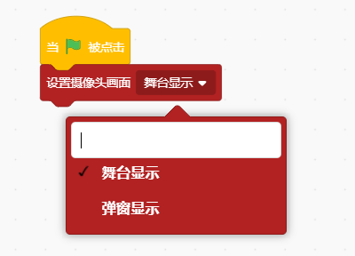
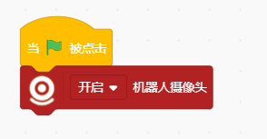
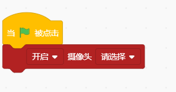
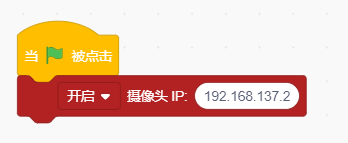

# Vision Recognition Blocks
## 设置摄像头画面（）

设置摄像头画面显示的区域为舞台区显示/弹窗显示

示例：

## （）机器人摄像头

开启/镜像开启/关闭机器人摄像头

示例：

## （）摄像头（）

开启/镜像开启/关闭电脑摄像头

示例：

## （）摄像头ip（）

开启/关闭/镜像开启网络摄像头

示例：

## 机器人摄像头开启成功

判断机器人的摄像头是否开启成功

示例：

