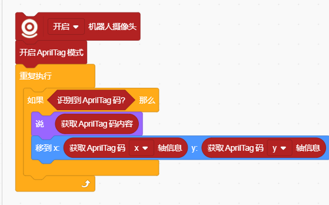
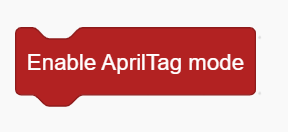
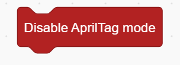
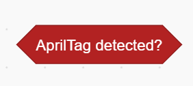

# AprilTag Mode Blocks
## Example

## Enable AprilTag Mode

Enables AprilTag recognition using the computer’s camera.

## Disable AprilTag Mode

Disables AprilTag recognition.

## AprilTag Detected?

Checks whether an AprilTag has been successfully detected.

## Get AprilTag Content

Returns the content (ID) of the detected AprilTag.

## Get AprilTag () Axis

Returns the X or Y position of the detected AprilTag.

## Get AprilTag ()

Returns information such as ID / Width / Height of the detected tag.

