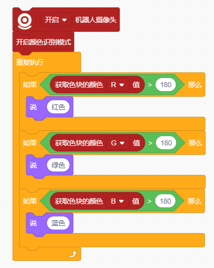

# Color Recognition Block
## Example

## Enable Color Recognition Mode

Enables color recognition using the computer camera.

## Disable Color Recognition Mode

Disables the color recognition feature.

## Get Color Block () Value

Returns the RGB value of the detected color block.

