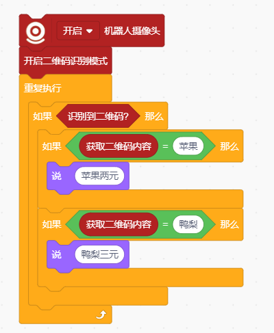
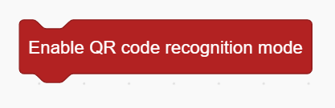
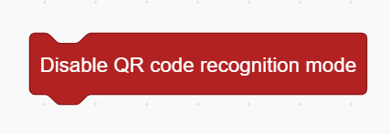
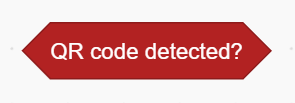

# QR Code Recognition Blocks
## Example

## Enable QR Code Recognition Mode

Enable the QR code recognition.

## Disable QR Code Recognition Mode

Disable QR Code Recognition Mode

## QR Code Detected?

判断是否识别到二维码

## Get QR Code Content

获取二维码识别到的内容

## Get QR Code () Axis

Get QR Code (X/Y) Axis

## Get QR Code ()

Get QR Code (Width/Height

