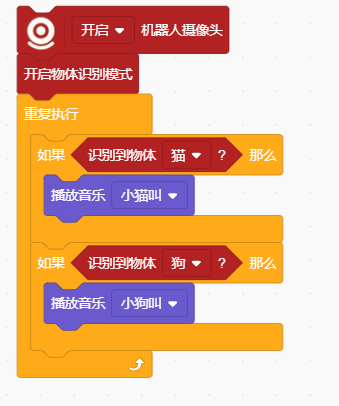
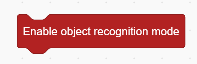
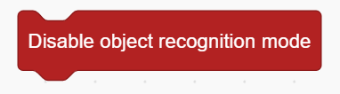
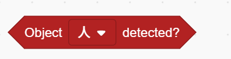

# Object Recognition Mode Blocks
## Example

## Enable Object Recognition Mode

## Disable Object Recognition Mode

## Object Detected ( )

## Get Object Position ()

Get Object Position (X/Y)

## Get Object ()

Get Object (Width/Height)

