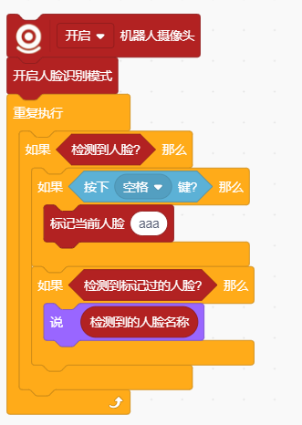

# Face Recognition Mode Blocks
## Example

## Enable Face Recognition Mode

Enable Face Recognition Mode

## Disable Face Recognition Mode

Disable Face Recognition Mode

## Face Detected?

Face Detected?

## Number of Faces Detected

Returns the number of faces detected

## Get Face Position ()

Get Face Position (X/Y)

## Get Face ()

Get Face (Width/Height)

## Label Current Face As ()

Mark the current face as a specified name (for subsequent recognition)

## Reset Faces

Reset (delete) all marked faces

## Labeled Face Detected?

Determine whether a marked face has been detected

## Detected Face Name

Returns the name of the detected face

