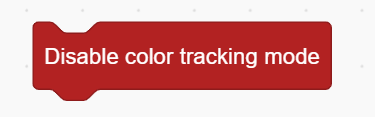

# Color Position Tracking Blocks
## Example

## Enable Color Position Tracking Mode

Activates the color position tracking mode.

## Disable Color Position Tracking Mode

Deactivates the color position tracking mode.

## Set Tracking Color ()

Sets the color to be tracked.

## Target Color Detected?

Checks whether the target color is currently detected.

## Target Color is Located at ()

Determines where the target color appears on the screen:  Center / Left/ Right/ Top/ Bottom.

