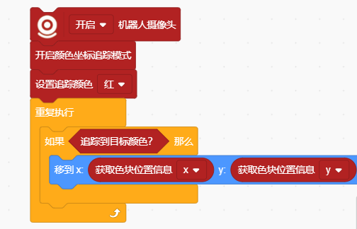
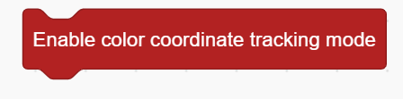
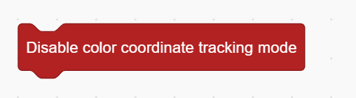
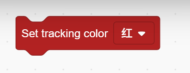
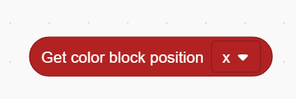
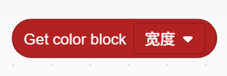

# Color Tracking Mode Blocks
## Example

## Enable Color Tracking Mode

Enable Color Tracking Mode

## Disable Color Tracking Mode

Deactivates the color tracking mode.

## Set Tracking Color ()

Sets the target color to be tracked.

## Target Color Detected?

Checks whether the target color is currently detected.

## Get Color Block Position ()

Returns the position of the detected color block:

x – horizontal position

y – vertical position

## Get Color Block ()

Returns the size of the color block:

width or height.

