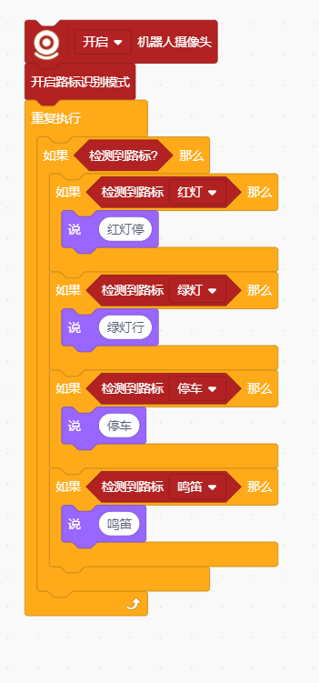
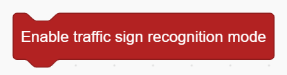
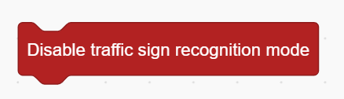
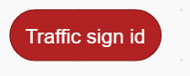
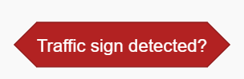
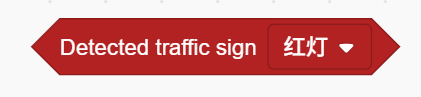

# Road Sign Recognition Blocks
## Example

## Enable Road Sign Recognition Mode

Enables the robot’s road sign recognition function.

## Disable Road Sign Recognition Mode

Disables the road sign recognition function.

## Return Road Sign ID

Returns the ID of the detected road sign.

## Detected Road Sign?

Checks whether any road sign has been detected. Returns true/false.

## Detected Road Sign (ID)?

Checks whether the specified road sign ID has been detected.

