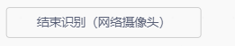

# Machine Learning Blocks
## Start Training Model

Click to enter the machine learning interface.

## Start Recognition (Computer Camera)

Enable the computer's camera to recognize using the trained model.

## Stop Recognition (Computer Camera)

Stop recognition and turn off the computer camera.

## Start Recognition (Robot Camera)

Turn on the robot's camera and start recognition.

## Stop Recognition (Robot Camera)

Stop recognition and turn off the robot camera.

## Start Recognition (Web Camera)

Enable an external network camera and start recognition.

## Stop Recognition (Web Camera)

Stop recognition using the network camera.

## Recognition Result is ()

Check whether the recognized result matches the selected category.

## Confidence of Recognizing () is

Return the confidence score for the specified category.

## Example
Train two machine learning models and use programming logic to make the character respond differently based on which model is successfully recognized.

## Operation Steps
|  |  |
| --- | --- |
| Step 1: Connect ICRobot to the programming software (refer to AP/STA connection method). | Step 2: Add the Machine Learning Extension. |
|  |  |
| Step 3: Click "Start Training Model" to select the training type: image recognition, gesture recognition, or pose recognition. | Step 4: Choose to Create a New Project or Import an Existing Project. |
|  |  |
| Step 5: Click the camera icon under each category to enable the corresponding camera. | Step 6: Continuously capture training images using the camera. |
|  |  |
| Step 7: Click the "Train Model" button to begin training. If you want to save the project, click “Export Project” in the top-right corner. Click "Use Model" in the bottom-right corner to return to the block programming interface. |  |

## Demonstration

