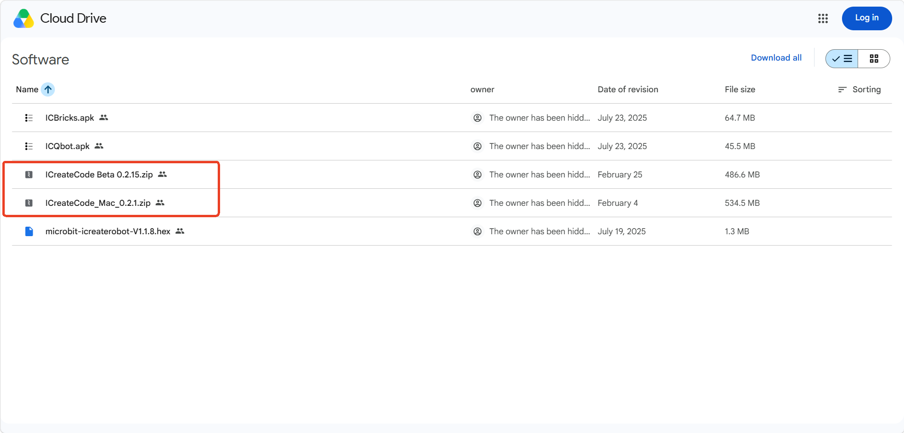
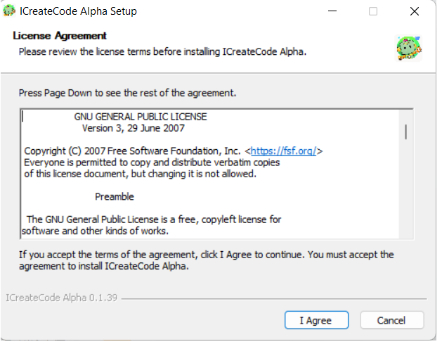
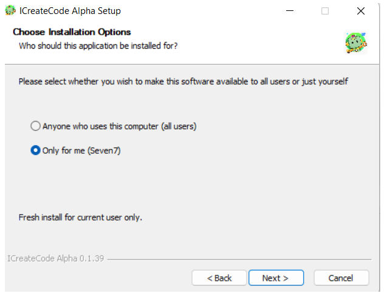
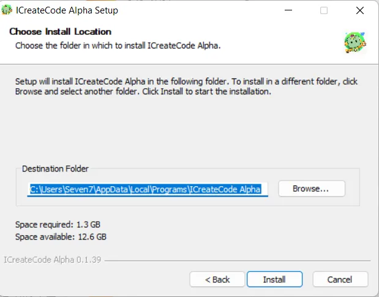
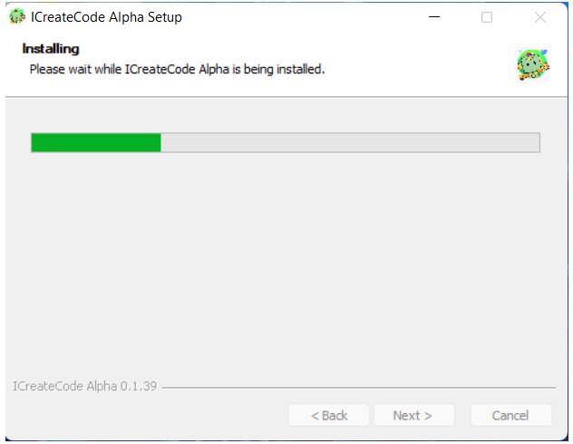
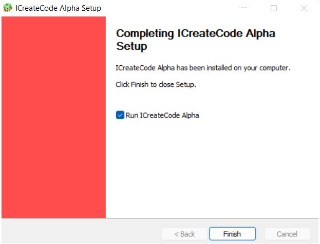
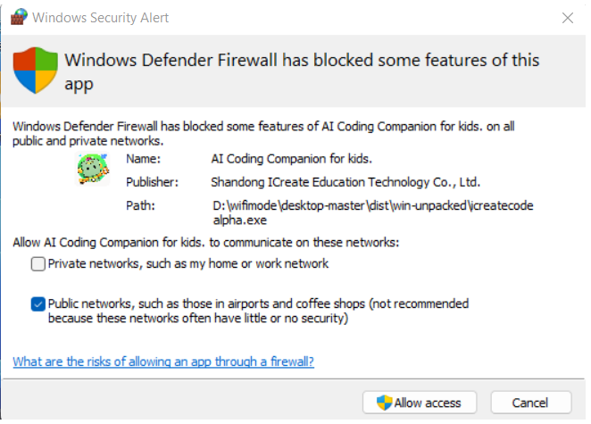
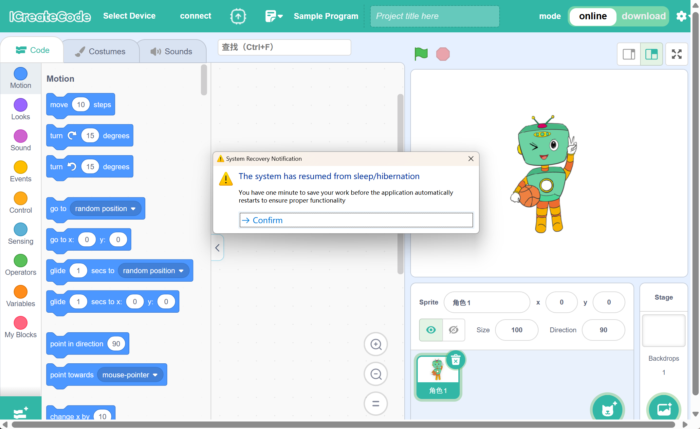

# Software Installation – ICreateCode
## System Requirements
The ICreateCode programming software supports Windows .

Windows: Requires 64-bit Windows 10 or later;

## Download
You can download the ICreateCode software installation package from Google Drive. [Click to download](https://drive.google.com/drive/folders/1BelSOfzXOhKQjtSsvhnTnV4FC-a3zJ6A?usp=sharing) 

## Installation Steps
1. After clicking the link above to open the page, select and download the appropriate installation package based on your device model.

2. After downloading the installation package to your local computer, extract it and double-click the file with the “.exe” extension.
   

3. When the installation window appears, click "I Agree" to accept the license agreement.

4. By default, select “Install for me only”, then click Next.

Note: You will be prompted to choose whether to install the software for the current user only or for all users on the computer. The difference is as follows:
① This option installs the software for the current user account only. After installation, only this user can access and use the software.
    ② This option installs the software for all user accounts on the computer. Any user on this device will be able to run the software.

5. Choose installation path: It is recommended to install to Disk C. If C drive space is insufficient, click Browse to choose another drive.

Click Install and wait for the process to complete.

Just wait for the installation to be complete.

6. Click mouse to complete, and then the network access permission will pop up. **Be sure to select Allow.**

  

7. The software is installed.  

## Notes
<!-- 这是一张图片，ocr 内容为： -->

To ensure the software functions properly:

+ If the computer goes into sleep mode and then wakes up, the software will start a 1-minute countdown to save your project.
+ After that, the software will restart automatically.

