# Machine Learning Blocks
## Start training model
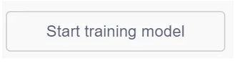

Click to enter the machine learning interface.

## Start recognition (computer camera)
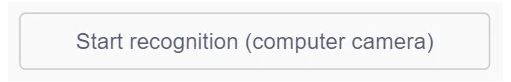

Enable the computer's camera to recognize using the trained model.

## Start recognition (robot camera)

Turn on the robot's camera and start recognition.

## Stop Recognition
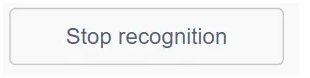

Stop recognition and turn off the robot camera and computer's camera.

## Start Recognition (Web Camera)
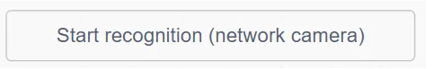

Enable an external network camera and start recognition.

## Recognition result is ()
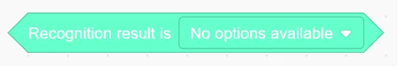

Check whether the recognized result matches the selected category.

## Confidence of recognizing ()
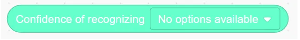

Return the confidence score for the specified category.

## Example
Train two machine learning models and use programming logic to make the character respond differently based on which model is successfully recognized. 
*Note: If the trained model is referenced in the program, the trained model can be used directly when the project is saved locally and later reopened and imported into the programming software. Retraining is not required.*

## Operation Steps
|  | 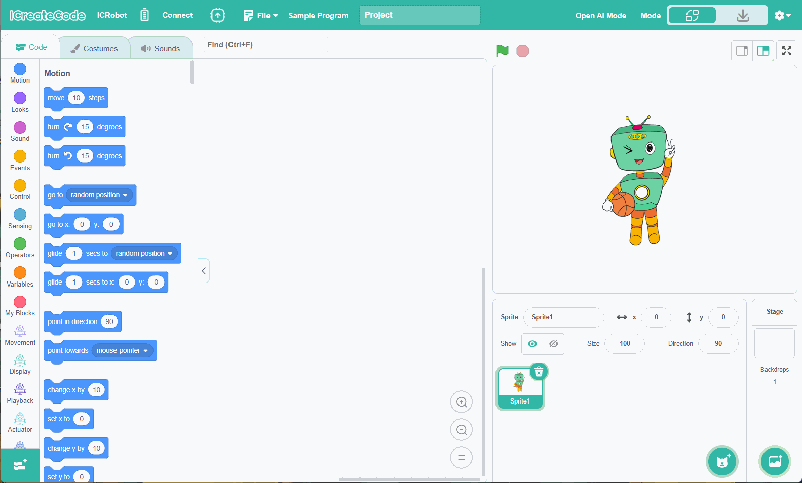 |
| --- | --- |
| Step 1: Connect ICRobot to the programming software (refer to AP/STA connection method). | Step 2: Add the Machine Learning Extension. |
| 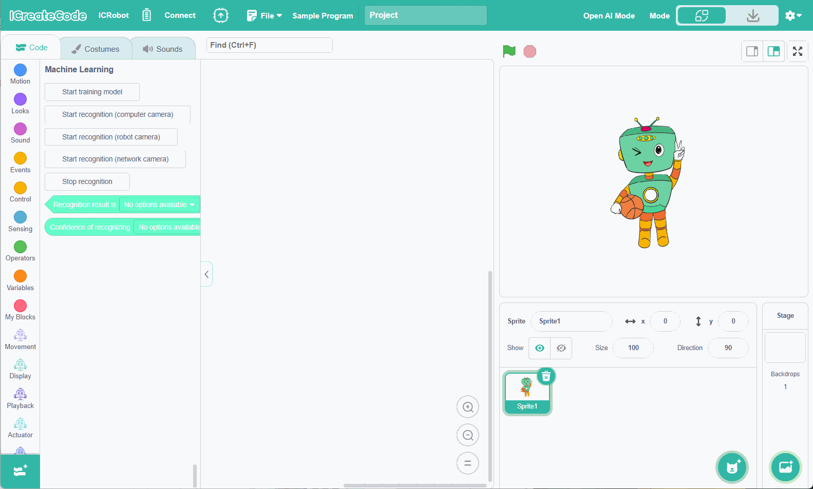 | 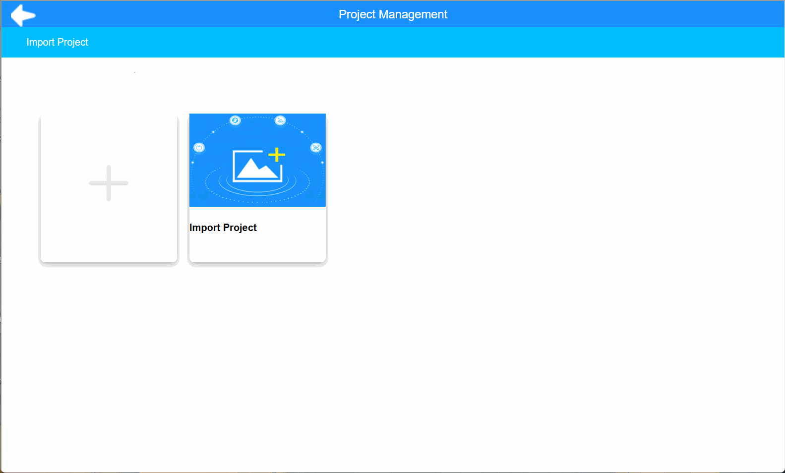 |
| Step 3: Click "Start Training Model" to select the training type:  image recognition, gesture recognition, or pose recognition.    Image recognition is used as an example here.| Step 4: Choose to Create a New Project or Import an Existing Project.&nbsp;&nbsp;&nbsp;&nbsp;&nbsp;&nbsp;&nbsp;&nbsp;&nbsp;&nbsp;&nbsp;&nbsp;&nbsp;&nbsp;&nbsp;&nbsp;&nbsp;&nbsp;&nbsp;&nbsp;&nbsp;&nbsp;&nbsp;&nbsp;&nbsp;&nbsp;&nbsp;&nbsp;&nbsp;&nbsp;&nbsp;&nbsp;&nbsp;&nbsp;&nbsp;&nbsp;&nbsp;&nbsp;&nbsp;&nbsp;&nbsp;&nbsp; |
| 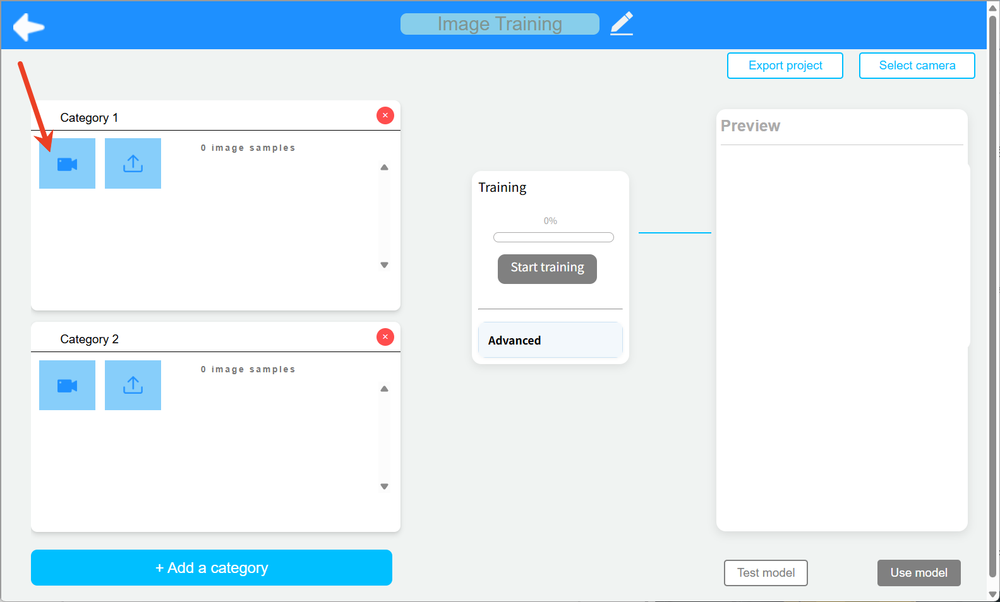 | 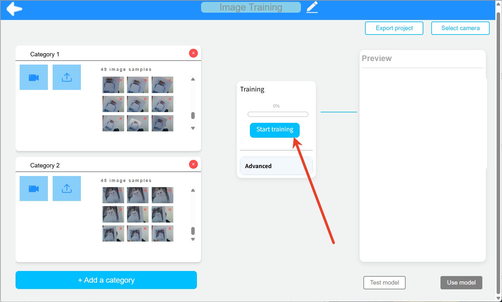 |
| Step 5: Click the camera icon under each category to enable the corresponding camera. | Step 6: Continuously capture training images using the camera. |
| 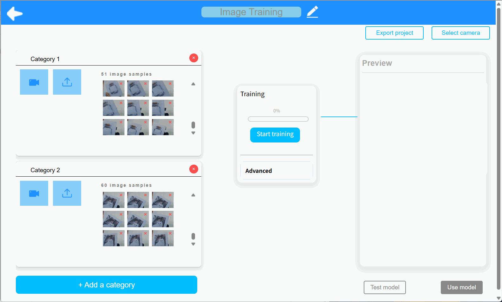 |  |
| Step 7: Click the "Train Model" button to begin training. If you want to save the project, click “Export Project” in the top-right corner. Click "Use Model" in the bottom-right corner to return to the block programming interface. For the two trained models, the corresponding commands will be generated.  Select and use the appropriate commands as needed for programming.
 |  |

## Demonstration
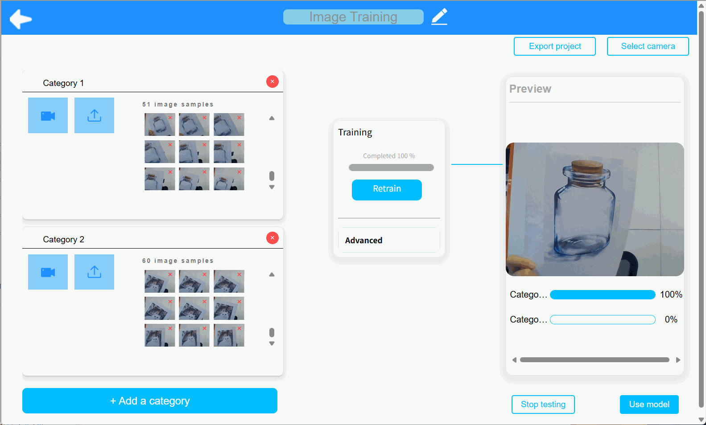

