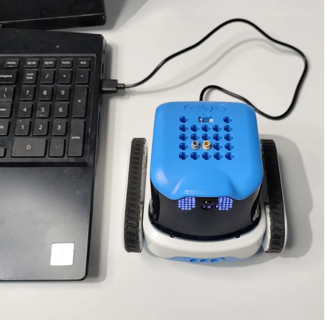
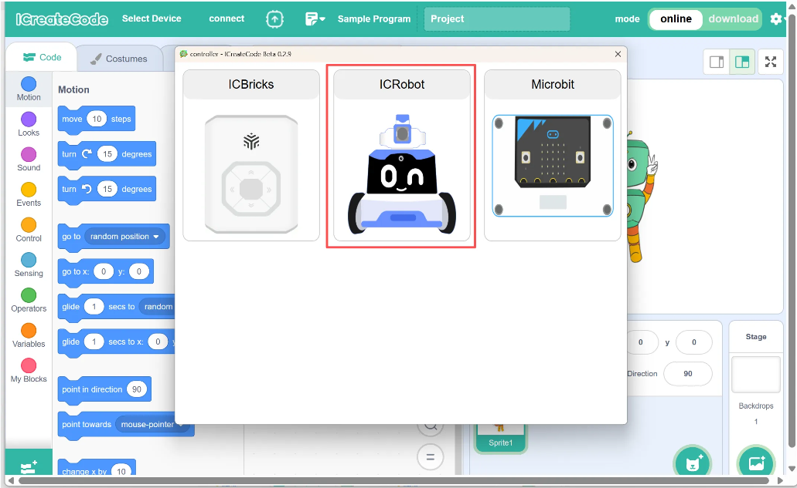
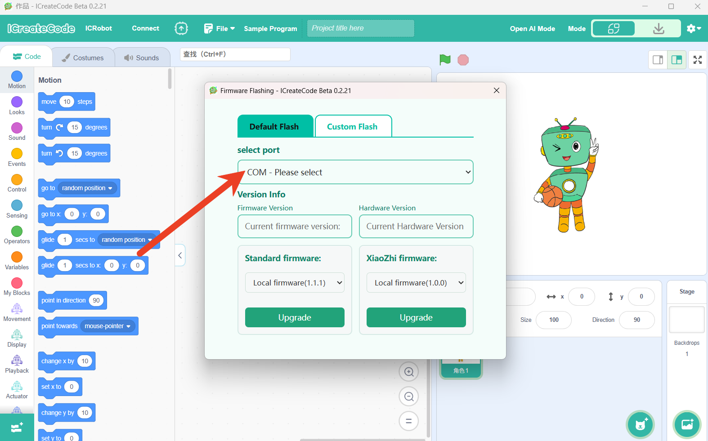
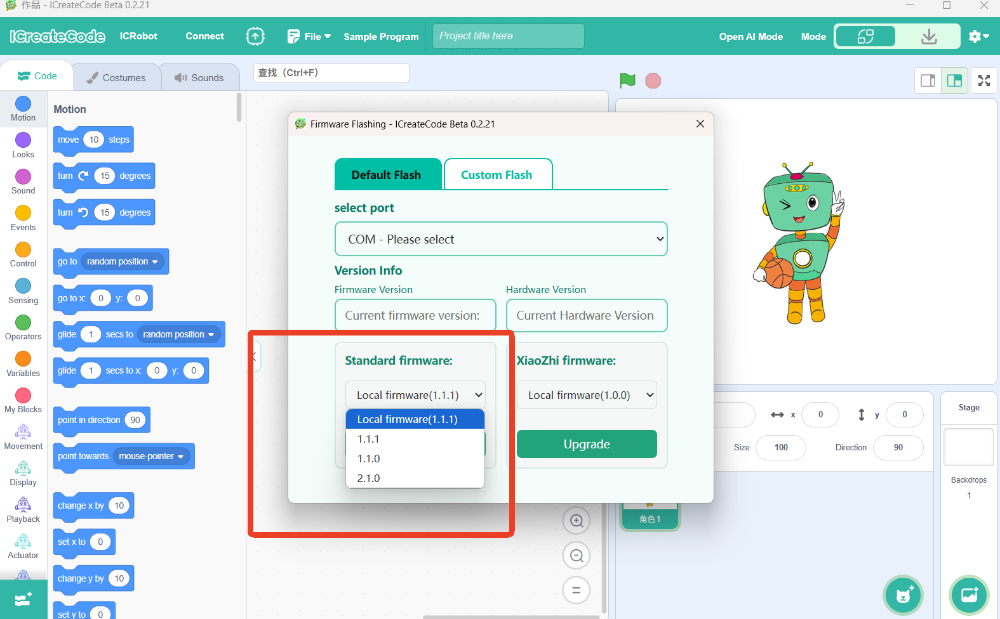

# Firmware Flashing

## Instructions

If you need to update the firmware version of the ICRobot robot, please refer to this document for detailed instructions.

## Steps
|||
|:-:|:-:|
|Step 1: Connect the device. Plug the ICRobot into the computer and power it on.||
|||
|Step 2: Open the software and click “Select Device.”|Step 3: Choose “ICRobot.”|
|||
|Step 4: Close the connection method directly.|Step 5: Select the “Firmware Burning” option.|
|||
|Step 6: Choose the correct COM port for firmware burning.|Step 7: Select the firmware type to be flashed: Default Flashing — Standard firmware version.  After selecting the desired version, click Upgrade. Note: If the selected firmware version name does not include the label “(Local Firmware)”,  the computer must be connected to the internet during the flashing process.|
|||
|Step 8: No further action is needed — wait for the firmware flashing to complete.|Step 9: No further action is needed — flashing is complete.|

