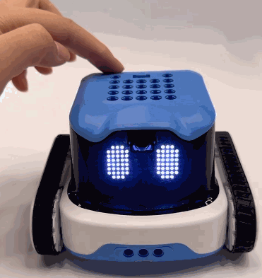
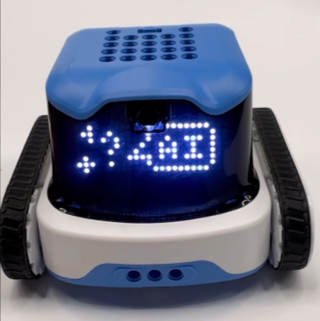
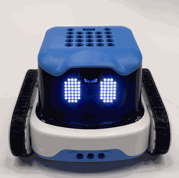
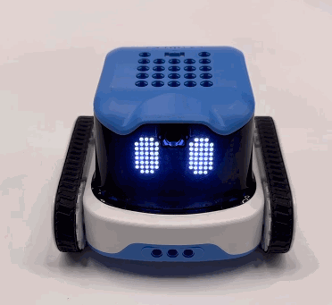
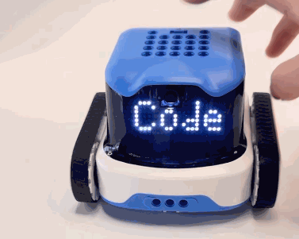

# Firmware Switching

## Switching fromStandard Edition Firmware to Xiaozhi Edition Firmware

After flashing the Standard Edition firmware, the device will boot into the Standard Edition by default. To switch to the Xiaozhi Edition, you can perform a one-touch switch in mode.

**Operation Steps**

|  |  |
| --- | --- |
| 1. Power on the device running the Standard Edition firmware. | 2. Use the left and right buttons to navigate and switch the current mode to. |
|  |  |
| 3. After entering , select the interface displaying “AI”. | 4. The display will show a switching progress indicator. Once the process is complete, the device will switch to Xiaozhi AI mode and enter network configuration mode. For network configuration steps, please refer to the [Xiaozhi AI User Guide](https://icreaterobot-icrobot-docs.readthedocs.io/en/latest/docs/ICRobot/04OperationManual/02XiaoZhiAIConfigurationGuide.html) |

## Switching from Xiaozhi Edition Firmware to Standard Edition Firmware

When the machine is in **Xiaozhi Version** mode, to switch to the **Standard Version**, turn on the machine, use the ◀️ ▶️ buttons or the 🅰️ 🅱️ buttons to switch to the **Code** interface, and then press the Power button to switch versions.

**Operation Steps**

|  ||
| --- | --- |
| 1. Power on the device running the Xiaozhi Edition firmware. | 2. Use the ◀️ ▶️ buttons or the 🅰️ 🅱️ buttons to switch to the **Code** interface and select the desired option. |
|  ||
| 3. The display will show the switching progress.  Once the device prompts “Please scan the QR code to connect to the network,” br/<>the switch is complete. For usage instructions,  please refer to the [Robot Programming User Guide](https://icreaterobot-icrobot-docs.readthedocs.io/en/latest/docs/ICRobot/02QuickStart/02ProgrammingtheRobotviaSoftware.html) | |

